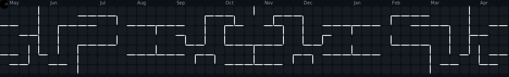

<h2 align="center">👋Hello, I'm Kidus Yosef</h2> 

###

 

  

###

<h4 align="center">Software Developer | Web Developer | UI/UX Designer  Full-stack developer with experience in frontend, backend, and mobile development — focused on building scalable applications with intuitive user experiences.</h4>

###

 

<picture>
    
</picture>

###

 

<h3 align="center">🌟 Skills & Technologies:</h3>

###

 

<h5 align="left">💻 Frontend: ReactJS (HTML, CSS, JavaScript), Vue.js, Tailwind CSS, Zustand ...  🧠 Backend: Django (Python), Laravel, PHP ...   🗄️ Database: MySQL, Firebase, MongoDB  ...  📱 Mobile Development: React Native (Expo), Flutter (Dart), Android Studio  ...  🧰 Tools: VS Code, Figma, Git, Vite  ...</h5>

###

 

<h3 align="center">💻 Languages and Tools:</h3>

###

  
  
  
  
  
  
  
  
  
  
  
  
  
  
  
  
  
  
  
  
  
  
  
  
  
  
  
  
  
  
  
  
  
  
  
  
  
  
  
  
  
  
  
  
  
  
  
  
  

###

<h3 align="center">🌐 Socials:</h3>

###

  
  
  

###

 

<h3 align="center">🏆CERTIFICATION AND AWARDS</h3>

###

 

📜 Certificate of Completion   Successfully completed the Front-End Development track, including UI/UX Design and Professional Development Skills at ALX.  🧰 Certificate of Completion   Completed both the Django and Flutter tracks — including a capstone and active participation in a hackathon — organized by GDSC AASTU.  🏆 Certificate of Achievement   Ranked among the Top 5 projects in the hackathon organized by Google Developer Student Club (GDSC) at Addis Ababa Science and Technology University.  🤝 Certificate of Participation   Recognized for active involvement in the GDSC AASTU Hackathon event.  🎉 Certificate of Participation   Participated in the AASTU TECH FEST 2025 Hackathon.  🐍 Certificate of Completion   Earned a Python certification from HackerRank, validating core programming skills.

###

 

  
  

###
