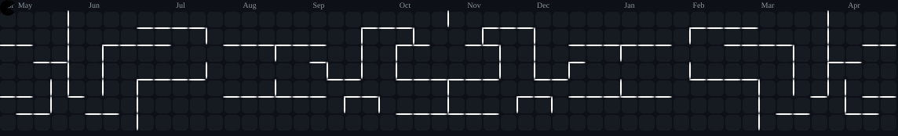

<h1 align="center">Hello — I'm Kidus Yosef</h1>  

###

 

  

###

<h3 align="center">
Full-Stack Engineer (Node.js / Next.js) • Real-time & Backend Systems Specialist • Mobile & Frontend Expert
</h3>

I build production-ready web and mobile applications — transactional backends, real-time systems, and polished frontends. Currently demonstrated with Fulfilio, a multi-tenant, real-time fulfillment platform (Node, Postgres, Redis, Socket.IO, Stripe). <a href="https://github.com/kid-yP/Fulfilio">View Fulfilio repo</a> • <a href="https://fulfilio-omega.vercel.app">Live demo</a>

Available for freelance/contract work and open to backend or full-stack roles. Contact: kidusmekuria11@gmail.com

###

 

<picture>
    
</picture>

###

 

<h3 align="center">Skills & Technologies:</h3>

 

<h4 align="left">
Frontend: Next.js, TypeScript, React.js (HTML, CSS, JavaScript), Vue.js, Tailwind CSS, Redux Toolkit, Zustand, Shadcn UI, Framer Motion.  
Backend: Node.js (TypeScript), Express.js, Prisma ORM, Django (Python), Laravel (PHP), NestJS (familiarity). Built production-grade services with transactional Postgres and background workers (BullMQ).  
Database & Storage: PostgreSQL, Redis, Firebase (Firestore), MySQL, Supabase, Cloudinary (file uploads), Pinecone (vector DB for RAG).  
Mobile Development: React Native (Expo), Flutter (Dart), Android Studio (Java/Kotlin).  
API Integration & AI: RESTful APIs, GraphQL, Axios, Fetch, Postman, Stripe (Checkout + webhooks), OpenAI API, Anthropic Claude (optional), Cohere (embeddings).  
System & DevOps: Docker, Docker Compose, Render (blueprint), Vercel, Cloudflare Tunnel, GitHub Actions (CI), health checks, monitoring basics, Redis adapter for Socket.IO (scaling).  
Testing & Tools: Jest, Supertest (integration tests with real Postgres), ESLint, TypeScript type checks, Prisma migrations & seed, bull-board for queue visibility.  
Tools: VS Code, Figma, Git & GitHub, Vite, Postman, Vercel, Render, Stripe Dashboard, Resend (email provider), Cloudflare Tunnel.
</h4>

 

<h2 align="center">Languages and Tools</h2>

 

  
  
  
  
  
  
  
  
  
  
  
  
  
  
  
  
  
  
  
  
  
  
  
  
  
  
  
  
  
  
  
  
  
  
  
  
  
  
  
  
  
  
  
  
  
  
  
  
  
  
  
  
  
  
  
  
  
  
  
  
  
  
  
  
  
  
  
  
  

###

<h2 align="center">Socials</h2>

  
  
  

###

 

<h2 align="center">Certifications and Coursework</h2>

DataCamp — Associate AI Engineer for Developers (coursework completed): LLM fundamentals, prompt engineering, OpenAI API usage, embeddings, semantic search, building chatbots and production AI patterns.  
ALX — Data Science program (in progress): data literacy, Python for data, supervised & unsupervised learning fundamentals (planning & exploration).  
ALX — Pro Dev Front-End Certificate: frontend engineering, UI/UX, and professional development skills.  
Additional certifications: Django, Flutter, Node.js/Express coursework through GDSC AASTU; Python certification from HackerRank.

 

  
  

###
