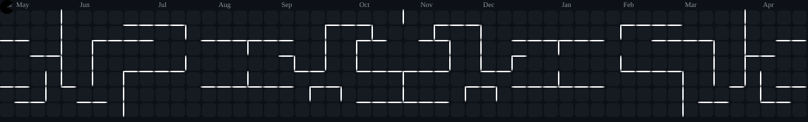

<h1 align="center">Hello, I'm Kidus Yosef</h1>  

###

 

  

###

<h3 align="center">
Full-Stack Engineer (Node.js / Next.js) • Real-time & Backend Systems Specialist • Mobile & Frontend Expert
</h3>

I design and build production-grade web and mobile applications with a backend-first approach — transactional databases (Postgres, Redis), robust APIs (Node/Express, Prisma), background jobs and reliable payment flows — paired with modern frontends (Next.js, TypeScript, Tailwind) and cross-platform mobile apps (React Native, Flutter). I prioritise correctness under concurrency, automated tests, CI/CD, observability, and practical AI integrations that deliver real value.

Contact: <a href="mailto:kidusmekuria11@gmail.com">kidusmekuria11@gmail.com</a> · <a href="https://github.com/kid-yP">github.com/kid-yP</a> · <a href="https://www.linkedin.com/in/kidus-yosefm">linkedin.com/in/kidus-yosefm</a>

###

 

<picture>
    
</picture>

###

 

<h3 align="center">Skills & Technologies</h3>

 

<h4 align="left">
Frontend: Next.js, React, TypeScript, Vue.js, Tailwind CSS, Shadcn UI, Framer Motion, Redux Toolkit, Zustand.  
Backend: Node.js (TypeScript), Express, Prisma ORM, Django (Python). Built transactional services backed by Postgres and background workers (BullMQ).  
Data & Storage: PostgreSQL, Redis, Firebase (Firestore), MySQL, Pinecone (vector DB for RAG).  
Mobile: React Native (Expo), Flutter (Dart).  
AI & Integrations: RAG pipelines, Cohere embeddings, Pinecone, LangChain, Stripe (Checkout + webhooks), REST APIs, Postman.  
DevOps & Tools: Docker, GitHub Actions (CI), Vercel, Render, Prisma migrations, monitoring & health checks basics.  
Testing: Jest, Supertest, integration tests with real Postgres, custom concurrency harnesses.
</h4>

 

<h2 align="center">Languages and Tools</h2>

 

  
  
  
  
  
  
  
  
  
  
  
  
  
  
  
  
  
  
  
  
  
  
  
  
  
  
  
  
  

###

<h2 align="center">Socials</h2>

  
  
  

###

 

  
  

###
